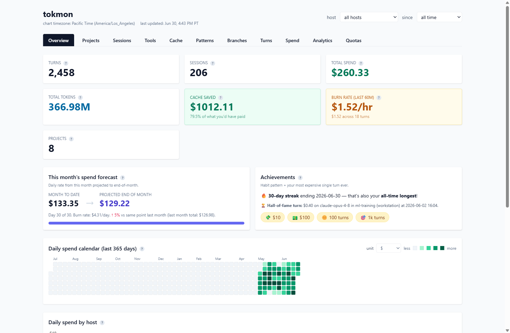
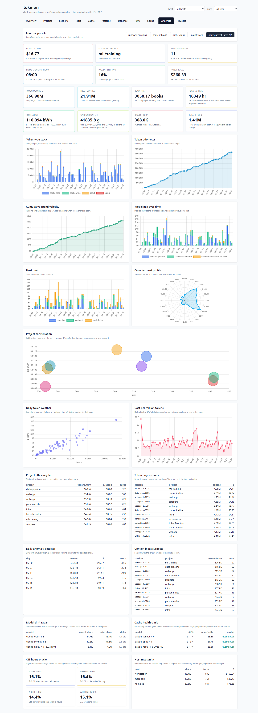

# tokmon

Local analytics for Claude Code token usage.



<details>
<summary><b>See the deep-dive analytics view</b></summary>



</details>

> The screenshots above use synthetic sample data, not real usage.

`tokmon` reads the transcript files that Claude Code already writes to your
computer, loads the usage data into a small local database, and gives you a
clean web dashboard and command-line reports showing where your tokens (and
dollars) actually go: by project, model, session, branch, tool, and time of day.
You can run it on a single computer, or have several computers feed one shared
dashboard.

Everything runs on your own machines. Nothing is sent to any third party.

---

## Which setup is right for me?

- **Just one computer?** Follow **[Option 1: One computer](#option-1-one-computer)**.
  This is the easy path and takes about five minutes.
- **Want to combine usage from several computers into one dashboard?** Do Option
  1 first to get comfortable, then see
  **[Option 2: Several computers](#option-2-several-computers-into-one-dashboard)**.
  That path involves connecting machines over SSH and is more advanced.

---

## Before you start: install Python

tokmon needs **Python 3.11 or newer**. To check whether you already have it,
open a terminal and run:

```bash
python3 --version
```

(On Windows, use `python --version`.) If it prints `Python 3.11` or higher,
you're set. If not, install it:

| Your computer | How to install Python |
| ------------- | --------------------- |
| **Windows**   | Run `winget install Python.Python.3.12` in PowerShell, or download from [python.org](https://www.python.org/downloads/) and check "Add Python to PATH" during install. |
| **macOS**     | Install [Homebrew](https://brew.sh), then `brew install python@3.12`. (Or download from [python.org](https://www.python.org/downloads/).) |
| **Linux**     | `sudo apt install python3 python3-venv python3-pip` (Debian/Ubuntu) or the equivalent for your distro. |

**How to open a terminal:** on **Windows** press `Win`, type "PowerShell", and
open it. On **macOS** press `Cmd+Space`, type "Terminal", and open it. On
**Linux** it's usually `Ctrl+Alt+T`.

---

## Option 1: One computer

### 1. Get the code

If you have `git`:

```bash
git clone https://github.com/Edgecaser/tokenMonitor.git
cd tokenMonitor
```

No `git`? Go to the [repository page](https://github.com/Edgecaser/tokenMonitor),
click the green **Code** button, choose **Download ZIP**, unzip it, then `cd`
into the unzipped folder.

### 2. Install tokmon

This creates a self-contained environment so tokmon doesn't touch the rest of
your system.

**macOS / Linux:**

```bash
python3 -m venv .venv
source .venv/bin/activate
pip install -e .
```

**Windows (PowerShell):**

```powershell
python -m venv .venv
.venv\Scripts\Activate.ps1
pip install -e .
```

> If PowerShell says running scripts is disabled, run this once, then try again:
> `Set-ExecutionPolicy -Scope CurrentUser RemoteSigned`

After this, the word `tokmon` is a command you can run. (Each new terminal needs
the activate step again: `source .venv/bin/activate` on macOS/Linux, or
`.venv\Scripts\Activate.ps1` on Windows.)

### 3. Load your usage data

```bash
tokmon ingest
```

This reads `~/.claude/projects/` (where Claude Code keeps its transcripts) and
builds the database. Re-run it any time to pick up new activity.

### 4. Open the dashboard

```bash
tokmon serve
```

Leave that running, then open your web browser to:

**http://127.0.0.1:8765**

You'll see charts for spend, tokens, models, projects, and more. Press `Ctrl+C`
in the terminal to stop the dashboard when you're done.

### 5. (Optional) Keep it updating automatically

Instead of re-running `tokmon ingest`, you can have tokmon watch for new activity
and load it live:

```bash
tokmon watch
```

That's the whole single-computer setup.

---

## Option 2: Several computers into one dashboard

This setup has two roles:

- A **hub** — one **Linux** computer that stays on (a Raspberry Pi, a home
  server, or any always-on Linux box). It collects everyone's data and serves
  the dashboard.
- One or more **clients** — your laptops/desktops (Windows, macOS, or Linux).
  Each one automatically copies its Claude Code transcripts to the hub every 10
  minutes.

### What you need first

1. **The hub reachable over SSH.** Each client must be able to log into the hub
   with `ssh`. The setup scripts use an SSH **key** (no password prompts). If you
   haven't set one up, on each client run:

   ```bash
   ssh-keygen -t ed25519           # press Enter through the prompts
   ssh-copy-id <hub-user>@<hub-host>   # copies your key to the hub
   ```

   (On Windows, `ssh-copy-id` may not exist; the Windows setup script below
   prints the exact one-line command to copy your key instead.)

2. **For machines on different networks: [Tailscale](https://tailscale.com).**
   Install it on the hub and every client so they can reach each other by a
   stable name from anywhere. Recommended but not required if everything is on
   the same home network.

3. **`rsync` and `ssh` on each client.** macOS and Linux have these already. On
   **Windows**, install them from MSYS2 (the Windows setup script checks for this
   and tells you exactly what to run if they're missing):

   ```powershell
   winget install --id MSYS2.MSYS2 -e
   C:\msys64\usr\bin\pacman -S --noconfirm rsync openssh
   # then add C:\msys64\usr\bin to your PATH
   ```

Throughout the examples below, replace the placeholders with your real values:
`<hub-user>` is your login name on the hub, `<hub-host>` is its hostname or
Tailscale name (e.g. `raspberrypi`), and `/home/<hub-user>` is its home folder.

### Step 1: Set up the hub

The easiest way is to run the installer **from a client that has the code**. It
copies the code to the hub and configures everything (a background service for
the dashboard plus a timer that ingests new data automatically):

```bash
./deploy/install-on-pi.sh --pi-user <hub-user> --pi-host <hub-host>
```

When it finishes it prints the dashboard URLs, for example
`http://<hub-host>:8765/`.

> Prefer to work on the hub directly? Copy the repo there, then run
> `bash ~/tokmon-app/deploy/setup-pi.sh`.

### Step 2: Connect each computer (client)

Run the script that matches each computer. It writes the connection settings,
schedules an automatic push every 10 minutes, and does a first push right away.

**Windows (PowerShell, from the repo folder):**

```powershell
.\deploy\setup-client-windows.ps1 -PiUser <hub-user> -PiHost <hub-host> -PiPath /home/<hub-user>
```

**macOS:**

```bash
./deploy/setup-client-macos.sh --pi-user <hub-user> --pi-host <hub-host> --pi-path /home/<hub-user>
```

**Linux:**

```bash
./deploy/setup-client-linux.sh --pi-user <hub-user> --pi-host <hub-host> --pi-path /home/<hub-user>
```

Each client appears in the dashboard as its own host, so you can compare usage
across machines.

### Step 3: View the dashboard

Open a browser to the hub's address (printed at the end of Step 1):

**http://&lt;hub-host&gt;:8765**

New data flows in on its own: clients push every 10 minutes, and the hub ingests
on a timer.

### Updating the hub later

On the hub, run:

```bash
tokmon-update
```

It pulls the latest code, reinstalls, and restarts the dashboard.

---

## Everyday commands

Run these on whichever machine holds the database (your computer in Option 1, the
hub in Option 2):

```bash
tokmon summary               # headline totals
tokmon spend --by project    # project | model | day | hour | session | tool | host
tokmon top --metric cost     # biggest single turns by cost | tokens | ...
tokmon cache                 # how much caching is saving you
tokmon tools                 # which tools cost the most
tokmon hosts                 # per-machine rollup (Option 2)
tokmon project <name>        # drill into one project
tokmon session <id>          # drill into one session
tokmon serve                 # the web dashboard
```

Add `--help` to any command to see its options.

---

## Stopping or uninstalling

- **Option 1:** Stop the dashboard with `Ctrl+C`. To remove tokmon entirely,
  delete the project folder and the `~/.tokmon` folder.
- **Option 2 client — Windows:** open Task Scheduler and delete the `tokmon-sync`
  task.
- **Option 2 client — macOS:** `launchctl bootout gui/$UID/com.tokmon.sync`
- **Option 2 client — Linux:** run `crontab -e` and delete the `tokmon push` line.
- **Option 2 hub:** `systemctl --user disable --now tokmon-serve tokmon-ingest.timer`

---

## Troubleshooting

- **`tokmon: command not found`** — activate the environment first:
  `source .venv/bin/activate` (macOS/Linux) or `.venv\Scripts\Activate.ps1`
  (Windows).
- **The dashboard page won't load** — make sure `tokmon serve` is still running
  in its terminal, and that you used `http://127.0.0.1:8765` (Option 1) or the
  hub's address (Option 2).
- **Dashboard is empty** — run `tokmon ingest` at least once. If you've never
  used Claude Code on that machine, there's nothing to show yet.
- **Windows: "running scripts is disabled"** — run
  `Set-ExecutionPolicy -Scope CurrentUser RemoteSigned`, then retry.
- **Option 2: "SSH failed"** — confirm you can run
  `ssh <hub-user>@<hub-host>` by hand. If it asks for a password, set up a key
  (see "What you need first"). If the machines are on different networks, make
  sure Tailscale is connected on both.
- **Option 2 on Windows: "rsync not on PATH"** — install rsync from MSYS2 (see
  "What you need first").

---

## Privacy: what tokmon stores

For each assistant turn, tokmon records token counts, the dollar equivalent
(using the editable price table in `tokmon/pricing.toml`), the model, and labels
like project, git branch, session, and host. It also keeps lightweight signals
such as character counts and short previews of tool-call inputs.

It does **not** store your prompts or Claude's responses. The database
(`tokmon.duckdb`) stays on your machine and is never uploaded; it's also excluded
from version control.

---

## Development

```bash
pip install -e ".[dev]"
pytest
```

Continuous integration runs the test suite on Python 3.11 and 3.12
(`.github/workflows/ci.yml`).

---

## License

MIT — see [LICENSE](LICENSE). Copyright © 2026 Ian Brillembourg.
